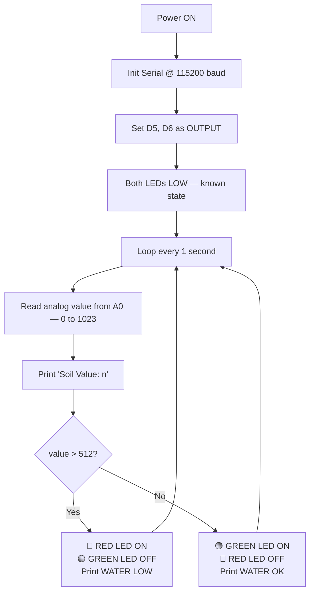

# 🌱 Soil Moisture Monitoring System
### IoT-Based Water Level Indication using NodeMCU ESP8266

*A low-cost embedded system that reads soil moisture continuously, shows a green/red LED status, and streams live readings to the Arduino IDE Serial Monitor.*

Built as part of the **ESSCI-Certified Embedded Systems & IoT Engineering** course at **SRM University AP**

---

## ⚙️ How It Works

The system works on one physical fact: **wet soil conducts electricity better than dry soil.**

A resistive probe in the soil feeds a voltage to the NodeMCU's ADC. The firmware reads this value every second, compares it to a threshold (`512` — the midpoint of the 10-bit ADC range), and does two things at once:

- 🟢 Turns on the **green LED** (`WATER OK`) or 🔴 the **red LED** (`WATER LOW`)
- 🖥️ Prints the raw ADC value and status to the Serial Monitor

> **Higher ADC value → drier soil. Lower ADC value → wetter soil.**
> The relationship is inverse because wet soil pulls the voltage divider output *down*.

---

## 🧩 Components

| Component | Specification |
|---|---|
| 🔷 NodeMCU ESP8266 | ESP-12E, 80 MHz, 3.3V logic, CP2102 USB-UART |
| 🌱 Soil Moisture Sensor | Resistive probe with LM393 comparator module |
| 🟢 Green LED (D5 / GPIO14) | 5mm diffused, ~2.0V forward drop |
| 🔴 Red LED (D6 / GPIO12) | 5mm diffused, ~1.8V forward drop |
| ⚡ Resistors | 220Ω–330Ω × 2 (current limiting for LEDs) |
| 🔌 Jumper Wires | Male-to-male and male-to-female |
| 🔗 USB Cable | Micro-USB, data-capable |

---

## 🔌 Circuit Connections

| Signal | NodeMCU Pin | Direction |
|---|---|---|
| Soil sensor analog output | `A0` | Input |
| Green LED | `D5` (GPIO14) | Output, Active HIGH |
| Red LED | `D6` (GPIO12) | Output, Active HIGH |
| Sensor power | `3V3` | Power |
| Common ground | `GND` | Reference |

> ⚠️ **Important:** The ESP8266 chip's ADC natively accepts only 0–1.0V. The NodeMCU board adds an on-board voltage divider at the A0 header pin that scales the usable range up to ~0–3.3V. This is why you can wire the sensor's analog output directly to A0 **on a NodeMCU**, but must **never** do so on a bare ESP-12E module.

> 💡 D5 (GPIO14) and D6 (GPIO12) are chosen specifically because they have **no boot-strapping restrictions** — other GPIO pins can prevent the board from booting if they're driven to the wrong level at power-up.

---

## 🔁 Firmware Logic

---

## 🛠️ Arduino IDE Setup

| Setting | Value |
|---|---|
| Board | `NodeMCU 1.0 (ESP-12E Module)` |
| CPU Frequency | `80 MHz` |
| Upload Speed | `115200` |
| Serial Monitor Baud | `115200` |
| Libraries | None (core Arduino only) |

> 🔎 Serial monitor baud rate **must** match the firmware (`115200`). If you see garbled output, this is the first thing to check.

---

## 📊 Threshold Logic

| ADC Range | Approx. Voltage | Condition | Green LED | Red LED | Serial Output |
|---|---|---|---|---|---|
| 0 – 512 | 0 – 1.65V | Wet / sufficient | 🟢 ON | ⚪ OFF | `WATER OK` |
| 513 – 1023 | 1.66 – 3.3V | Dry / insufficient | ⚪ OFF | 🔴 ON | `WATER LOW` |

`512` is the midpoint of the 10-bit ADC range and a safe default. Recalibrate for your specific soil type — see [Field Calibration](#-field-calibration).

---

## ✅ Test Results

| Condition | ADC Reading | Margin from 512 | LED | Serial |
|---|---|---|---|---|
| Dry soil / air | 590 – 593 | +78 to +81 | 🔴 Red ON | `WATER LOW` |
| Moist soil | 378 – 403 | −109 to −134 | 🟢 Green ON | `WATER OK` |

Both states are well separated from the threshold — **~190 counts apart** — so the system doesn't flicker at the boundary under normal conditions. Readings were stable within **±3 counts** in both states without any software filtering.

---

## 🎯 Field Calibration

If you're deploying this in actual soil (not just testing in air vs. water), calibrate the threshold for your soil type:

1. Insert the probe into thoroughly **dry** soil. Record the stable reading — this is your **dry reference**.
2. Water the soil to the ideal moisture level. Wait a few minutes. Record the new stable reading — this is your **wet reference**.
3. Set `MOISTURE_THRESHOLD` to the midpoint between the two values, reflash.
4. Test by cycling between the two conditions — the LED should switch cleanly each time.

### Factors that affect readings

| Factor | Effect |
|---|---|
| 🧱 Soil composition | Clay retains water and salts better than sand — same water content, different conductivity |
| 🧪 Fertiliser content | Raises ionic concentration, lowers ADC value independent of moisture |
| 📏 Probe insertion depth | More contact area = lower resistance |
| 🔌 USB supply quality | A weak USB source slightly shifts the divider output |

---

## ⚠️ Limitations

- 🦠 Resistive probes corrode over time from DC electrolysis — capacitive probes are better for long-term deployment
- 🔁 No hysteresis: a reading exactly at the boundary can toggle between states on successive samples
- 📡 ESP8266 has only one ADC channel — monitoring multiple plants requires an external multiplexer
- 📉 Readings are relative, not absolute volumetric water content
- 💾 No data persistence — disconnecting the PC loses all readings

---

## 🚀 Future Enhancements

- [ ] Add hysteresis (two separate thresholds for wet→dry and dry→wet) to eliminate boundary flicker
- [ ] Average multiple samples before comparison to suppress ADC noise
- [ ] Drive a relay/MOSFET to switch an irrigation pump automatically
- [ ] Publish readings via MQTT or HTTP to ThingSpeak / Blynk for remote monitoring
- [ ] Power the probe from a GPIO pin (only energise during measurement) to reduce electrode corrosion
- [ ] Add DHT22 for ambient temperature + humidity correlation
- [ ] Migrate to a capacitive probe for long-term stability

---

## 🙋 Author

**Galla Indranag**

B.Tech ECE
Embedded Systems & IoT Analyst (ESSCI-certified), (SRM AP)

- GitHub: [@indra675](https://github.com/indra675)
- LinkedIn: [linkedin.com/in/gallaindranag](https://linkedin.com/in/gallaindranag)

